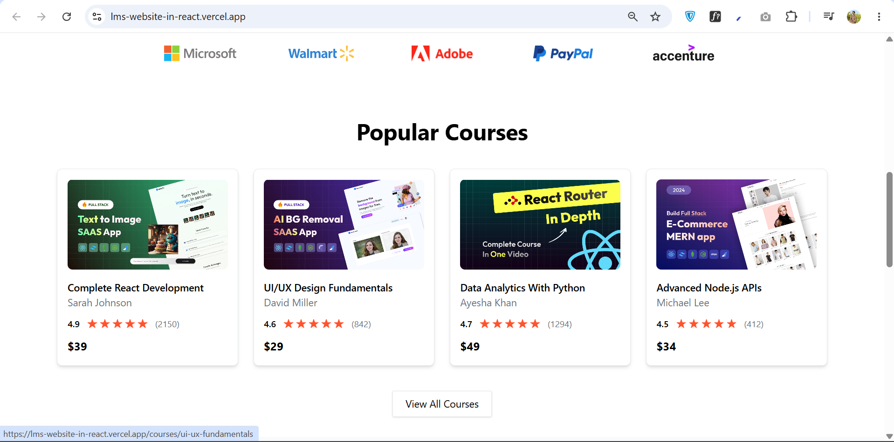
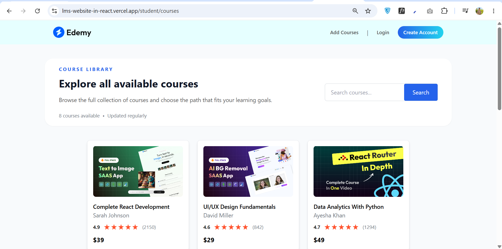
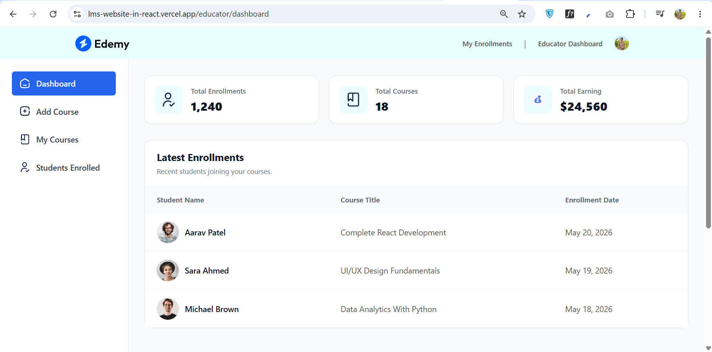
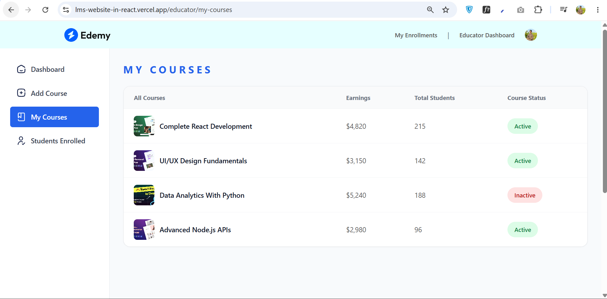
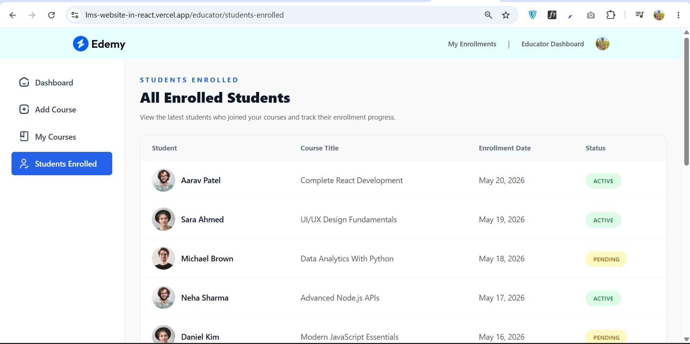

# 🎓 LMS Website (React.js)

A modern and responsive Learning Management System (LMS) frontend built using **React.js**. The project provides an intuitive user interface for students and instructors with a clean, responsive design and reusable React components.


## 🚀 Features

- Responsive Design
- Modern React.js Architecture
- Clean and User-Friendly Interface
- React Router Navigation
- Student Dashboard UI
- Instructor Dashboard UI
- Course Listing Page
- Course Details Page
- Authentication Pages (UI)
- Reusable Components
- Mobile Friendly Layout
- Fast Performance with Vite

---

## 🛠️ Tech Stack

### Frontend

- React.js
- JavaScript (ES6+)
- HTML5
- CSS3
- React Router DOM
- Vite

---

## 📂 Project Structure

```
src/
│
├── assets/
├── components/
├── pages/
├── layouts/
├── context/
├── App.jsx
└── main.jsx
```

---

## ⚙️ Installation

### Clone the repository

```bash
git clone https://github.com/hassan7226/Lms-Website-in-React.git
```

### Navigate to the project

```bash
cd Lms-Website-in-React
```

### Install dependencies

```bash
npm install
```

### Start the development server

```bash
npm run dev
```

---

## 📸 Screenshots









---

## 🎯 Future Improvements

- Node.js Backend
- Express.js REST API
- MongoDB Database
- JWT Authentication
- User Authorization
- Course Enrollment
- Video Lessons
- Assignment Submission
- Quiz System
- Progress Tracking
- Payment Integration
- Admin Dashboard
- Notifications
- Certificate Generation

---

## 📚 Learning Objectives

This project was built to practice:

- React.js
- Component-Based Architecture
- React Router
- State Management
- Responsive UI Design
- Reusable Components
- Frontend Development Best Practices

---

## 👨‍💻 Author

**Hassan Arshad**

- GitHub: https://github.com/hassan7226
- LinkedIn: https://www.linkedin.com/in/hassan7226/

---

## ⭐ Support

If you found this project helpful, consider giving it a ⭐ on GitHub.